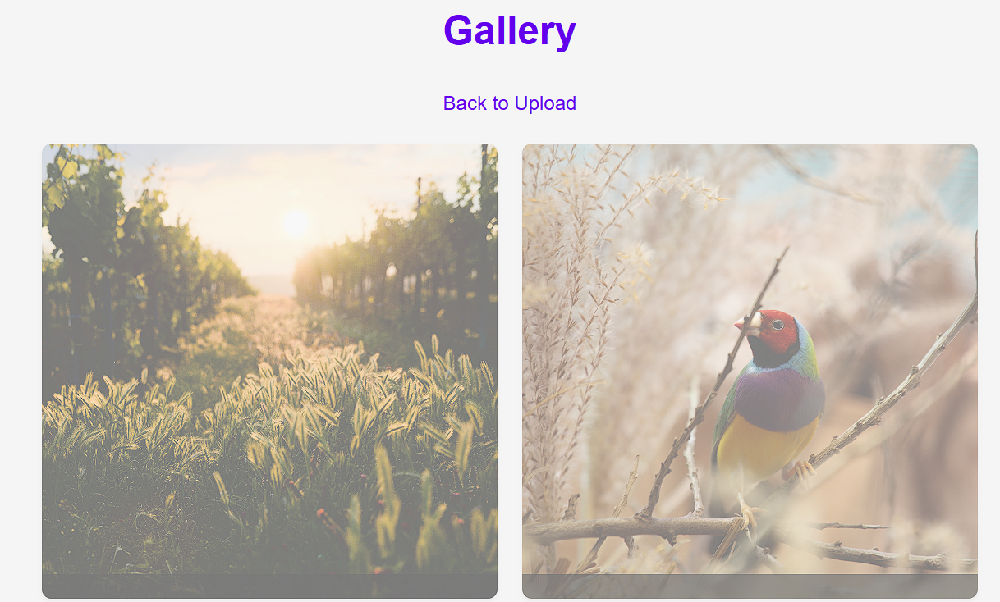

# SnapPic - Temporary Photo Sharing App

SnapPic is a Flask-based web application that allows users to temporarily share photos. Each uploaded image is displayed for 5 seconds, then fades out over 10 seconds before being automatically deleted.

## Features

- 📸 Upload images from camera or gallery
- ✏️ Add short comments (max 100 chars)
- ⏱️ Images automatically expire after 15 seconds (5s visible + 10s fade)
- 📱 Responsive design works on mobile and desktop
- ⚡ Progressive Web App (PWA) support
- 🔄 Auto-refreshing gallery updates every 2 seconds
- 🔒 Secure file upload handling

## Technology Stack

- **Backend**: Python Flask
- **Frontend**: Vanilla HTML/CSS/JavaScript
- **Storage**: Local filesystem for images, JSON for metadata
- **PWA**: Service Worker + Web Manifest

## Installation

1. Clone the repository:
```bash
git clone https://github.com/yourusername/snappic.git
cd snappic
```

2. Install dependencies:
```bash
pip install -r requirements.txt
```

3. Initialize data files:
```bash
echo '[]' > data.json
mkdir -p uploads
```

4. Run the application:
```bash
python app.py
```

5. Open in browser:
```
http://localhost:5000
```

## Project Structure

```
snappic/
├── app.py                 # Flask application
├── data.json              # Image metadata
├── uploads/               # Uploaded images
├── requirements.txt       # Python dependencies
├── README.md              # This file
├── templates/
│   ├── index.html         # Upload page
│   └── gallery.html       # Gallery page
└── static/
    ├── style.css          # Stylesheet
    ├── script.js          # Client-side logic
    ├── sw.js              # Service Worker
    ├── manifest.json      # PWA manifest
    └── icon-192.png       # App icon
```

## Development Notes

This project was created with the assistance of:
- [Aider](https://github.com/paul-gauthier/aider) - AI pair programming tool
- DeepSeek Chat - Large language model

## Screenshots

  
*The upload interface with camera/file selection and comment field*

  
*The gallery showing uploaded images with comments and fade effects*

## License

MIT License
